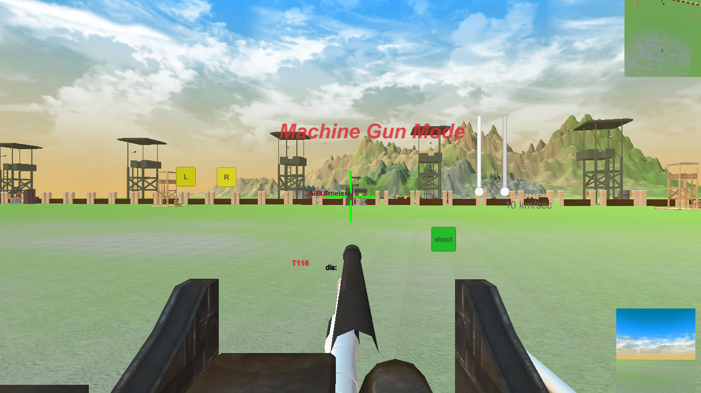
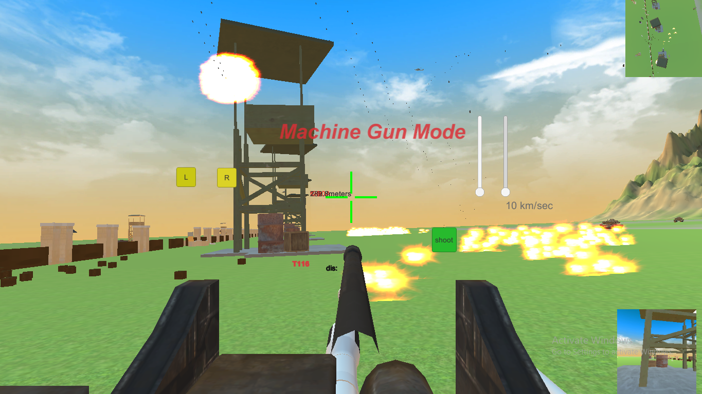
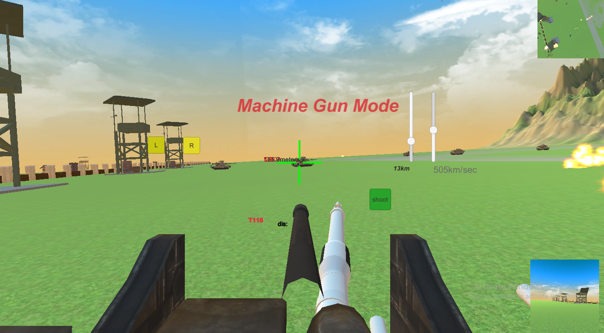
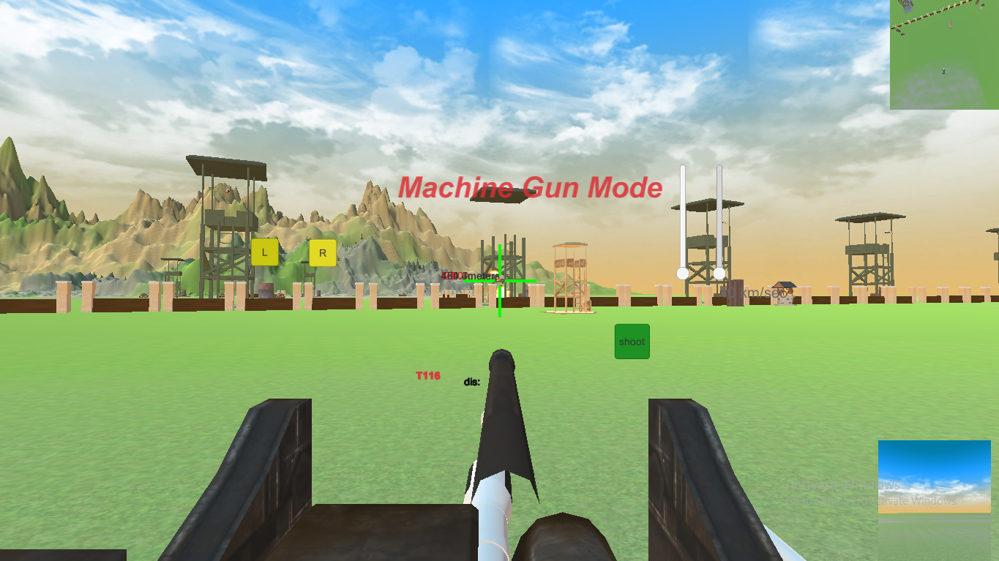
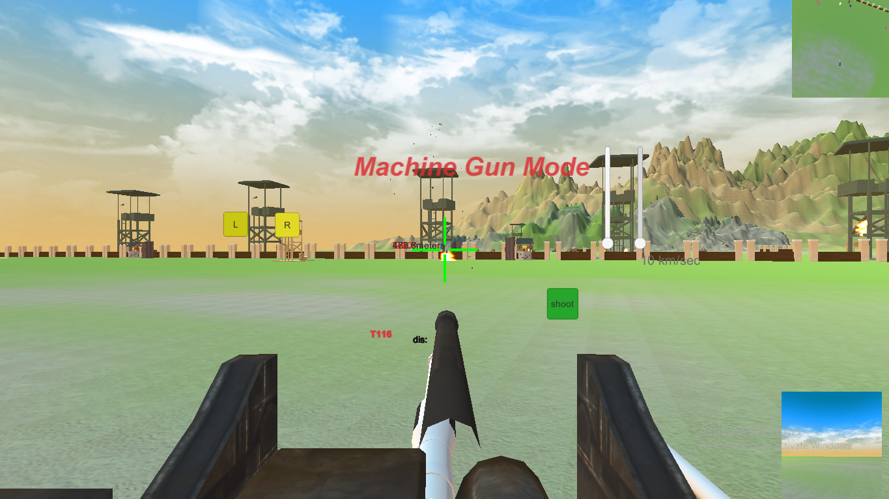
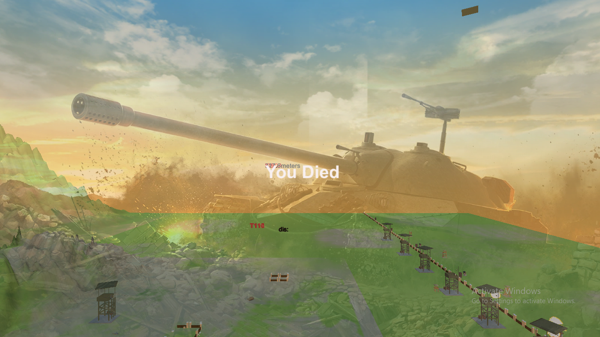

# MilitaryTankSimulator
<h1> The project is made by Shagoto Rahman Shrestho </h1>

The game starts with a terrible battleground. 

The View modes are there

<li>They are  
  <ul>Machine Gun Mode</ul>
  <ul>Barrel Mode</ul>
  <ul>Third Person View Mode</ul>

