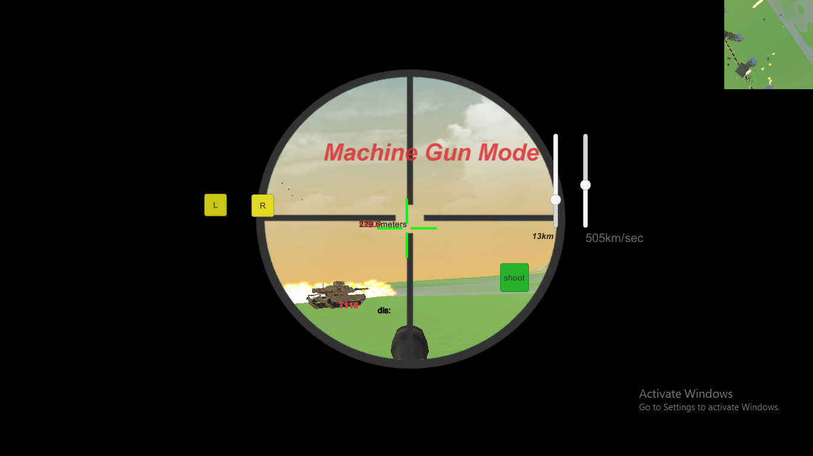
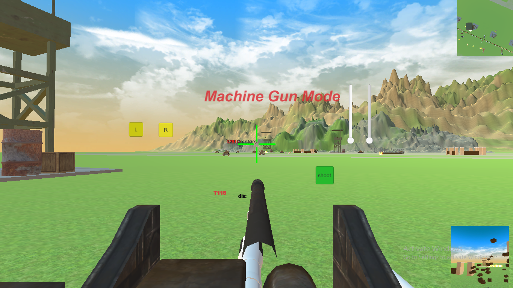
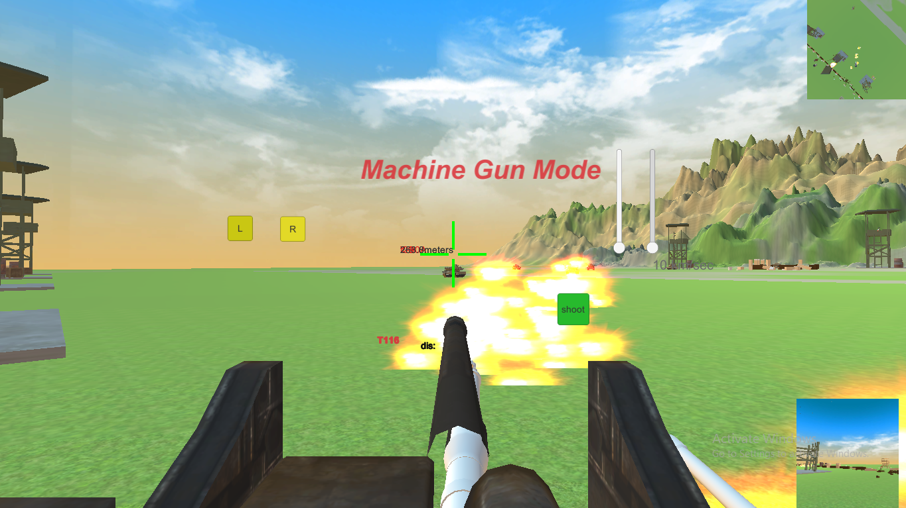
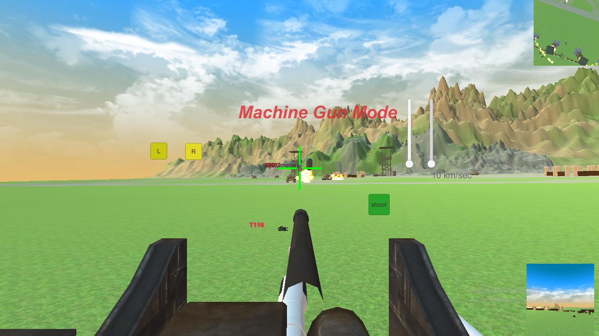
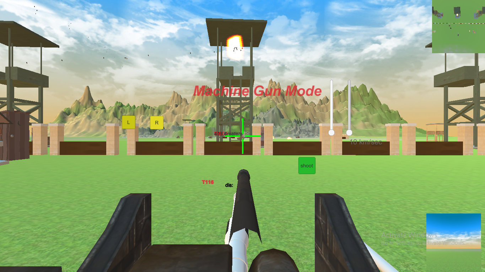

# MilitaryTankSimulator
<h1> The project is made by Shagoto Rahman Shrestho </h1>

The game starts with a terrible battleground. 

Three View modes are there

<li>They are  
  <ul>Machine Gun Mode</ul>
  <ul>Barrel Mode</ul>
  <ul>Third Person View Mode</ul>

  
There is also scope facility with speed changing mode

  
 Loads of military tanks are there.They will try to kill the player tank

  
Helicopters and Other firing structures are also been implemented

  

